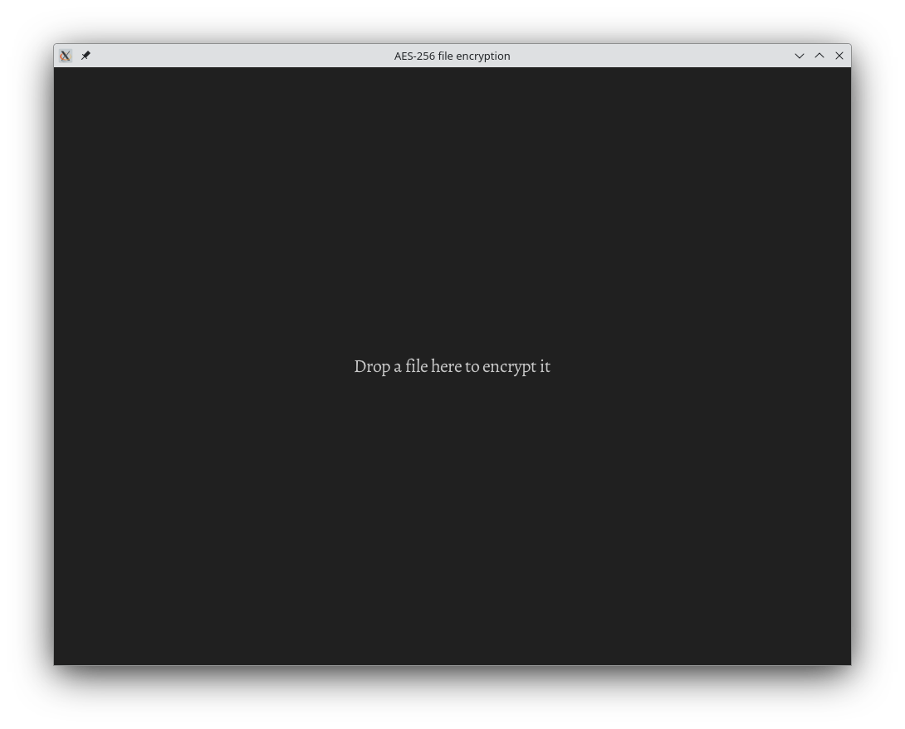
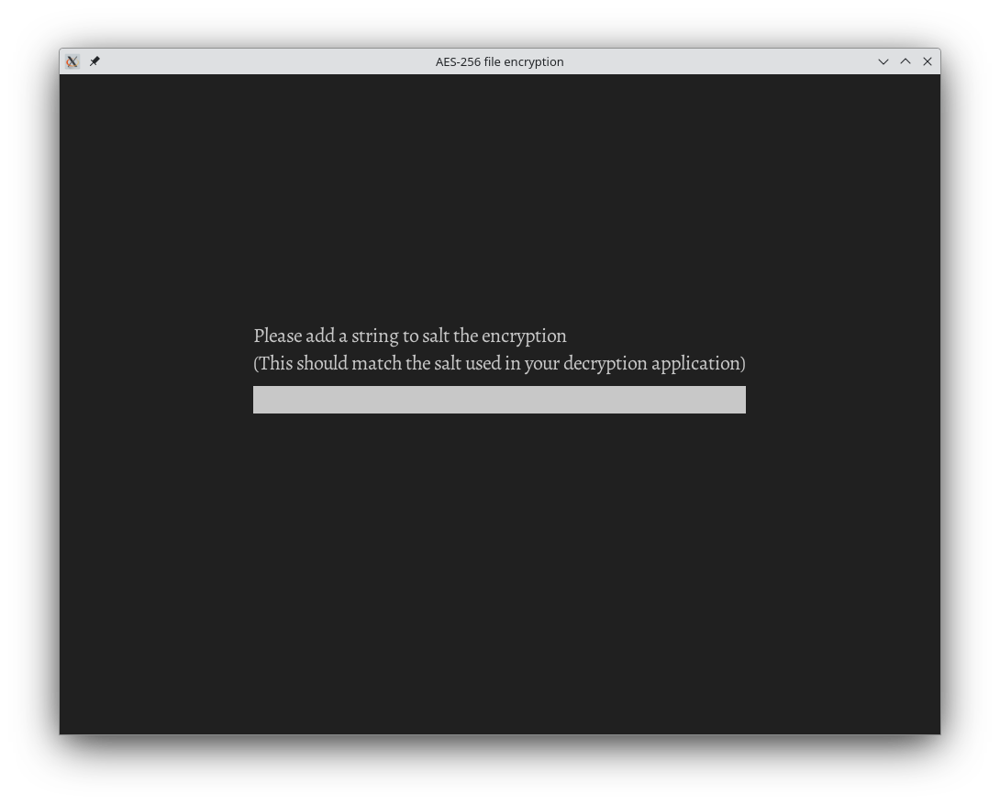
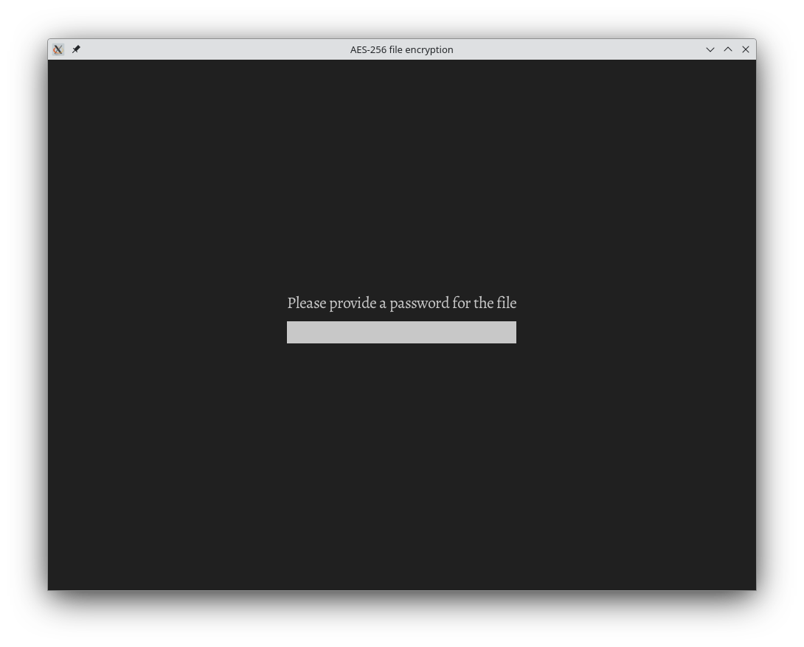

# Introduction

This is a GUI application that performs the AES-256 encryption of a file provided by the user.

# Usage

On starting the application, the user is greeted with the following screen.

The user should then drag and drop the file they wish to encrypt onto the GUI.  This will then ask them for a string with which to "salt" the encryption.

Although the user has complete freedom in choosing such a string (up to a 24 characters), they should make sure that it matches any hard-coded values in the application they will use to decrypt it.

After this, they are then asked to provide a password.

Once they do this, the file will be encrypted and saved in the same location as the original file, but with a ".enc" file extension.

# Passwords and salts

While the purpose of the password is probably obvious to most users, the purpose of a "salt" may be less clear to people not familiar with cryptography.  You can find some details [here](https://en.wikipedia.org/wiki/Salt_(cryptography)), but in essence a salt is a string that is added to the password before encryption.  It's purpose is to wreck attempts to use certain attacks against the encryption since the pre-calculated tables used in those attacks won't have been calculated with the given salt.

The main thing to remember is that the password should be unique to the file, while the salt need not be.

If the salt is hard-coded into the application you will use to decrypt the file, or if you have no control over the salt that will be used for decryption, it is important to make sure that the salt you provide during encryption matches it.

